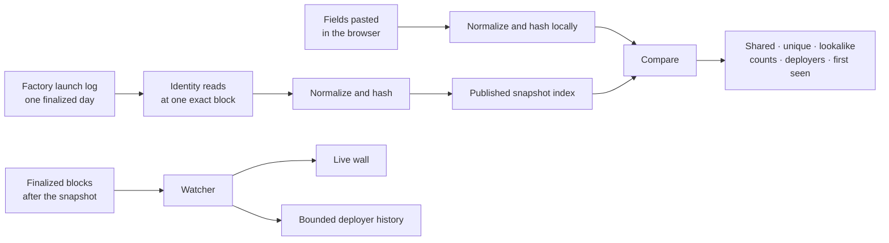

<p align="center">
  <a href="https://lintcha.com/">
    
  </a>
</p>

<h1 align="center">lintcha</h1>

<p align="center">
  <strong>Follow activity. Copy matched BUYs within your limits. Keep every SELL manual.</strong>
</p>

<p align="center">
  Copy-trading is the opt-in trading mode inside @lintchabot.<br>
  Lintcha Core keeps the original comparison and observer tools read-only.
</p>

<p align="center">
  <a href="https://t.me/lintchabot?start=copy_site">Open copy-trading</a>
  ·
  <a href="https://lintcha.com/">Website</a>
  ·
  <a href="https://lintcha.com/live/">Live wall</a>
  ·
  <a href="https://lintcha.com/deployer/">Deployer history</a>
  ·
  <a href="#run-in-sixty-seconds">Run locally</a>
  ·
  <a href="https://x.com/mnilax">@mnilax</a>
  ·
  <a href="https://x.com/lintchadotcom">@lintchadotcom</a>
  ·
  <a href="https://t.me/lintchabot?start=copy_site">Telegram Bot</a>
  ·
  <a href="https://t.me/lintchaRH">Telegram channel</a>
</p>

<p align="center">
  <a href="https://github.com/Mnilax/lintcha-chain/actions/workflows/test.yml?query=branch%3Amain"></a>
  <a href="https://github.com/Mnilax/lintcha-chain/actions/workflows/vendor.yml?query=branch%3Amain"></a>
  
  
  
  
  
</p>

<!-- the token line, when there is a token: uncomment and paste the contract
<p align="center"><b>$LINTCHA</b> · <code>0x...</code></p>
-->

> [!IMPORTANT]
> Copy-trading is internally isolated from read-only Lintcha Core. Auto-BUY remains disabled until the delegated-wallet, provider, simulation, contract-review and activation gates pass. Funds stay in the user's user-owned wallet; seed and private key never enter Telegram or the Lintcha backend. SELL is manual only.

## Copy-trading

Pick what to follow on Robinhood Chain, choose what happens when it moves, and keep the exit in your own hands.

| Mode | What happens |
| --- | --- |
| **Notify only** | Follow activity without preparing a transaction. You choose when to do anything next. |
| **Auto-copy BUY** | Matched BUYs are copied automatically within the caps, allowlists, slippage and expiry you set. |
| **Manual SELL** | No automatic selling. Approval and trade are reviewed and confirmed as separate wallet actions. |

**What you can follow.** A public wallet you add, or supported public BUY activity from launchpads such as pons. Every venue enters through an explicit allowlisted adapter. Lintcha does not invent a portfolio, rank traders or follow an account behind your back, and nothing is copied until your rule for that source is active.

**What a copied BUY has to pass.** A matching transaction is only the trigger:

1. **Match the source** — only activity from the wallet, venue, chain and BUY pattern named by your rule.
2. **Simulate current state** — a fresh quote and estimate, with independent RPC providers required to agree before anything is signed.
3. **Enforce your limits** — anything outside your per-trade and daily spend, slippage, router, spender, selector or expiry boundary is rejected.
4. **Submit once, then reconcile** — a permitted BUY is broadcast once; unknown, dropped or replaced states are reconciled without a blind automatic retry.

**What stays yours.** Funds stay in your self-custody wallet. No seed or private key enters Telegram or the Lintcha backend. Auto-BUY runs on a narrow, expiring, revocable permission; a per-user stop halts it immediately, and the service keeps a global broadcast stop. Every SELL starts from a fresh quote and needs its own wallet confirmation — there is no auto-SELL path.

**Status.** Copy-trading lives in [`copy/`](copy/) and is being prepared for production. Auto-BUY stays off until the delegated-wallet, provider, simulation, contract-review and activation gates pass.

[Open copy-trading in @lintchabot](https://t.me/lintchabot?start=copy_site)

### Under the hood

Copy supports notifications and a bounded auto-BUY path. An automatic BUY must match a selected source, pass two-provider simulation, fit both project and user caps, use an allowlisted chain, router and selector, and fit an active expiring delegation. Submission is one-shot: an uncertain result is reconciled manually and never broadcast again automatically.

The implementation uses a user-owned Privy embedded wallet with a revocable TEE signer plus an immutable Lintcha BUY-only Pons wrapper. The wrapper independently enforces factory provenance, per-trade and daily limits, slippage, expiry and pause state. Provider setup, independent contract review, the first dust acceptance transaction, deployment and public activation remain separate owner-approved actions.

## Lintcha Core: what the read-only tools do

A launch presents a name, ticker, description, links, logo URI and creator fee recipient. Those fields can be reused, intentionally or otherwise. lintcha-chain makes that reuse visible without turning it into a verdict.

Paste the fields exactly as the launch shows them. The browser normalizes and hashes them locally, compares them with the published snapshot index, and reports:

- whether the snapshot contains a matching value;
- how many launches carry it;
- how many distinct deployers carry it;
- when it first appeared in that window;
- whether a name or ticker shares a lookalike skeleton with a different spelling.

These counts describe the snapshot corpus. The browser does not know whether the launch being inspected belongs to that window, so it never infers or subtracts “this launch” from a count.

The comparison needs no account and no wallet. What you paste stays in the browser.

## What ships here

| Surface | What it does | Availability |
| --- | --- | --- |
| [Snapshot comparison](https://lintcha.com/) | Compares self-declared launch identity fields with one exact finalized day | Published |
| Verified specimen | Loads synthetic checked-in fields and runs them through the same browser engine against the current published snapshot | Shipped |
| Refusal gallery | Makes missing, too-short, unreadable, redirect and meaning boundaries visible without inventing a value or verdict | Shipped |
| Proof loop | Shows the exact paste → normalize → compare → read → receipt path as a user-controlled explanatory sequence | Shipped |
| [Live wall](https://lintcha.com/live/) | Renders publishable names and tickers only when the watcher supplies a complete verified suffix | Static page shipped; runtime state fails closed |
| [Deployer history](https://lintcha.com/deployer/) | Renders bounded retained declarations for one public deployer address when watcher state is readable | Static page shipped; retained range only |
| Fact receipts | Exports the exact input, rendered result and snapshot context locally as JSON or SVG, then verifies or replays the JSON offline | Shipped |
| Integrity manifest | Binds the exact published index and numbers bytes with SHA-256 | Shipped |
| Identity kit | Exposes the same normalization engine as an ESM library, offline JSON CLI and opt-in HTTP API | Shipped |
| Localized comparison | Builds the snapshot page in English, Spanish and Portuguese | Shipped |
| [Copy-trading in `@lintchabot`](https://t.me/lintchabot?start=copy_site) | Notifications or bounded auto-copy BUY; SELL remains an explicit manual wallet action | Local/pre-production service and database; activate only after its contract, provider and dust-acceptance gates |
| [Lintcha Core in Telegram](https://t.me/lintchabot) | Keeps the existing Read, Live, Deployer, token-state, holder-proof and finalized-feed commands read-only | Existing Core surface; unchanged |

The live path never mutates the comparison index. The snapshot stays pinned to its recorded state and window until a guarded refresh publishes a replacement.

## Run in sixty seconds

Node.js 24 or newer is required. The root project has no runtime dependencies to install.

```sh
git clone https://github.com/Mnilax/lintcha-chain.git
cd lintcha-chain

node tools/identity.mjs doctor
npm test
npm run build
```

`npm run build` writes the localized static comparison, root 404 page, sitemap and integrity manifest into `site/`. Serve that directory with any static HTTP server to inspect the built site.

## A read, end to end



The snapshot and live suffix remain separate on purpose. A new declaration cannot silently change a snapshot count, and an incomplete watcher suffix is never presented as complete.

## Fields compared

| Field | Comparison |
| --- | --- |
| Ticker | Exact normalized ticker, plus a separate lookalike skeleton |
| Name | Exact normalized name, plus a separate lookalike skeleton |
| Links | Twitter/X, Telegram, Discord, website and Farcaster, with published alias rules |
| Logo URI | Compared as written after raw-link normalization; never fetched |
| Creator fee recipient | Compared as normalized address text; never resolved |
| Description | Compared after normalization when it contains at least twelve words |

A missing field stays missing. An unreadable recipient stays unreadable. A short description is reported as too short rather than forced into a comparison.

## Snapshot, receipts and integrity

The checked-in snapshot bundle is finalized and state-pinned. Mutable figures live in versioned artifacts instead of badges or prose that will drift after the next refresh:

- [`site/launch-numbers.json`](site/launch-numbers.json) records the chain, exact block and timestamp window, identity-state block and hash, and collection counters.
- [`site/launch-index.json`](site/launch-index.json) stores counted truncated hashes, not the raw launch strings.
- [`site/launch-manifest.json`](site/launch-manifest.json) binds the exact index and numbers bytes, sizes and namespace counts.

Index keys use the first eight bytes of each normalized SHA-256 digest. A collision would merge counts and cannot be separated from the published index.

The page embeds the expected index digest and refuses a fetched index that does not match it. The watcher and identity CLI validate the published corpus against the same manifest.

A fact receipt contains the exact fields entered, the lines rendered by the page and the snapshot context used. It is created locally and makes no request. The page can export the same receipt as JSON or as a self-contained SVG card. A receipt is portable context, not independent proof.

The offline CLI can validate a JSON receipt's strict structure and exact file digest, or replay its input against the manifest-bound checked-in corpus and require every localized result line to match. Replay does not rebuild the chain snapshot. See [Fact-receipt verification and replay](docs/FACT_RECEIPTS.md).

## Privacy boundary

The first comparison fetches the index once from the same origin. Pasted fields are normalized, hashed and compared in the browser; they are not uploaded.

The site sets no cookie and loads no third-party script, font, image, analytics or beacon. URLs and logo URIs entered into the tool are compared as strings and are never opened by the comparison.

The public site does not call `/api/identity`. That endpoint is an opt-in integration surface: a client that calls it sends the submitted strings to the Worker. The Worker keeps no identity request state, echoes no submitted declaration and answers from the same manifest-bound public index. Use the browser or offline kit when the strings must not cross the network.

## Developer commands

### Identity CLI

The CLI writes JSON and uses the same normalization engine as the browser.

```sh
node tools/identity.mjs help
node tools/identity.mjs doctor
node tools/identity.mjs normalize --field ticker --value '$bob'
node tools/identity.mjs read --input ./identity.json
node tools/identity.mjs receipt-verify --receipt ./lintcha-chain-fact-receipt.json
node tools/identity.mjs receipt-replay --receipt ./lintcha-chain-fact-receipt.json
```

`read` uses the checked-in index and manifest by default. A custom index is refused unless its matching manifest is supplied. `receipt-verify` checks the receipt itself; `receipt-replay` additionally binds the checked-in index and numbers to their manifest and reproduces the exact rendered lines locally.

### Identity HTTP API

`POST https://lintcha.com/api/identity` accepts the same complete JSON input as `node tools/identity.mjs read` and returns the engine result with the verified corpus SHA-256, byte count and entry count. It requires `Content-Type: application/json`, stores nothing and never echoes submitted fields.

```sh
curl https://lintcha.com/api/identity \
  --header 'content-type: application/json' \
  --data @identity.json
```

Successful responses use schema `lintcha-chain/identity-api/v1` and engine `LINTCHA_12`. Shape, media-type, rate-limit and unavailable-corpus failures are machine-readable and fail closed.

### Useful commands

| Command | Purpose |
| --- | --- |
| `npm test` | Verify vendored files and run the root config, page, engine, index, workflow and identity contracts |
| `npm run build` | Rebuild the localized static output and integrity manifest |
| `npm run i18n` | Merge and validate the English, Spanish and Portuguese strings |
| `node tools/identity.mjs doctor` | Run the public identity conformance fixture |
| `npm run verify` | Re-read the published state and window, rebuild in a temporary directory and compare the index hash |
| `npm run smoke:production` | Compare deployed bytes, headers, redirects and fail-closed API behavior with this tree |
| `npm ci --prefix bot` | Install the bot's pinned development tooling |
| `npm test --prefix bot` | Run the Worker, Telegram, holder, feed, watcher, wall and history tests |
| `npm run bundle --prefix bot` | Build the Worker bundle |

`npm run verify` is the full network reproduction path, not a quick smoke. It needs historical-state access and a log route capable of the recorded range. The hosted refresh separates public log reads from protected historical reads through the repository's loopback-only RPC wrapper.

## Guarded snapshot refresh

The refresh workflow runs weekly, remains manually dispatchable and fails closed. [`.github/workflows/launch-refresh.yml`](.github/workflows/launch-refresh.yml) never pushes generated data directly to `main`.

When scheduled or deliberately dispatched, it:

1. pins the run to the exact clean `main` revision;
2. records one finalized identity-state block number and hash;
3. collects the latest complete day and reads every identity at that pinned numeric state;
4. re-reads the launch range through differently aligned page layouts and compares their complete canonical rows;
5. binds event hashes to finalized headers, checks sampled transaction envelopes and reconstructs the index and summary;
6. rebuilds the site and permits only the guarded publication-artifact set to differ in the commit;
7. opens a draft pull request and waits for the generated commit to pass both test and vendor workflows before marking it ready.

The alternate log layouts use the same configured public log endpoint. They detect truncation and boundary omissions, but are not described as independent-provider proof.

If a state, range, response, hash, file-membership or branch invariant fails, nothing is published and the previous snapshot remains intact.

## Live wall and deployer history

The watcher is designed to follow finalized factory-log blocks after the published snapshot boundary.

The live wall exposes only publishable self-declared names and tickers. Alongside them it states the snapshot boundary, last finalized block read, any startup gap, watcher freshness and a SHA-256 commitment to the exact ordered rows. The browser recomputes that commitment before displaying the response.

Deployer history uses the same retained watcher data for one supplied public deployer address. It is not an all-time wallet profile: it states the retained block range and exposes no token address or transaction.

Runtime availability is part of the claim. A missing, stale, incomplete or mismatched suffix fails closed instead of being shown as complete data.

## Telegram, holder proof and token activation

[`site/token.json`](site/token.json) is the single activation document shared by the static site and Worker. Its dormant form contains null values for the contract and buy routes; its active form requires one canonical nonzero address and a canonical HTTPS buy URL containing that address.

Before activation, token-dependent UI, holder and feed behavior remain dormant. The Telegram webhook may be connected through its explicit pre-token path: `/start` and `/site` work, while commands that require the token answer that no verified token exists and publish no placeholder. The repository already contains tested code for:

- the Telegram webhook and command router;
- the compact Mini App with Read, Live, Deployer and the published token state;
- inline cards for the Mini App, comparison, live wall, deployer history, source and current token status, shareable from any Telegram chat;
- public `/start`, `/ca`, `/price`, `/stats` and `/site` commands;
- private `/verify`, `/me`, `/forget`, `/rule`, `/rules` and `/unrule` commands;
- one-time holder verification with a plain signed message that moves, approves and spends nothing;
- finalized transfer reads and durable buy delivery;
- sell counters in `/stats`, without sell posts to the room;
- holder rules matched against the same published identity index;
- public tail, wall and deployer-history API routes.

The watcher-backed wall and history are architecturally separate from the token-dependent feed.

When the public contract and canonical buy link exist, the guarded local switch is:

```sh
npm run activate-token -- <CA> <PONS_HTTPS_URL>
```

The companion [Token activation workflow](.github/workflows/token-activation.yml) prepares the same review-only change. It validates the public inputs and configured chain reads before opening a draft pull request; it does not merge or deploy.

## Repository map

| Path | Responsibility |
| --- | --- |
| [`site/`](site/) | Static production output, snapshot artifacts, live wall, deployer history and holder page |
| [`src/templates/`](src/templates/) | Authored HTML shells |
| [`src/i18n-src/`](src/i18n-src/) | English, Spanish and Portuguese source strings |
| [`lib/identity.mjs`](lib/identity.mjs) | Public normalization and comparison integration surface |
| [`tools/`](tools/) | Build, collection, guards, verification, refresh support and identity CLI |
| [`bot/`](bot/) | Cloudflare Worker, Telegram, holder proof, feed, watcher and API routes |
| [`tests/`](tests/) | Root contracts, browser checks, refresh guards and production smoke |
| [`fixtures/identity-conformance.json`](fixtures/identity-conformance.json) | Public identity conformance fixture |
| [`VENDOR.md`](VENDOR.md) | Provenance and SHA-256 for every file copied from lintcha |
| [`CONTRIBUTING.md`](CONTRIBUTING.md) | Contribution rules and local checks |

## Source-first by design

lintcha is the source of the comparison engine. Vendored files are listed in [`VENDOR.md`](VENDOR.md) with their source commit and SHA-256 and are not edited in place. A change belongs upstream first, then returns here with an updated vendor row.

Files owned by this repository are listed separately. CI refuses missing, modified, duplicated or unlisted vendored paths.

If the site computes something this repository cannot reproduce, the repository has stopped being the source. That is a product failure, not a documentation problem.

## Lintcha Core: the eight never lines

These are the Lintcha Core product constraints verbatim. The lines themselves remain unchanged:

- no score, no probability, no rating, no ordering, and no colour that means good or bad
- no private index and no paid tier that reads more than this page reads
- no hosted key, and no signature anywhere that moves, approves or spends anything
- no third-party script, font, image, analytics or beacon on this site, on any page, ever
- no figure we did not read ourselves; a tile that cannot be read shows a dash and not a number from somewhere else
- no dates on this page, because a date that cannot be kept is worth less than a line that can be checked
- no closed core: if the site computes something the repository cannot, the repository is decoration
- no licence change

A proposal that weakens one of these lines changes Lintcha Core rather than extending it.

`@lintchabot` may also expose **copy-trading**, a separately labelled and voluntary mode inside Lintcha. It is internally isolated from Lintcha Core: it has a separate package/service, `/copy/` Mini App route, database namespace, configuration, audit log and kill switches. Core commands, Core data and the eight lines above remain read-only and unchanged.

The trading service never receives a seed, private key or session key through Telegram or the backend. Wallet creation, import, recovery and export stay in the protected client secure sheet. A bounded auto-BUY uses only public scope metadata and an opaque authorization reference; signing/submission belongs to a separately controlled delegated executor. Manual SELL approval and trade remain explicit wallet actions. Auto-SELL is not available.

Therefore statements such as “the bot never trades” or “no signature anywhere moves funds” refer to **Lintcha Core**, not to the whole `@lintchabot` identity. Every transition from Core to Copy must say so before a wallet or transaction control appears.

## Contributing

Start with [`CONTRIBUTING.md`](CONTRIBUTING.md) and use the repository's issue forms for reproducible bugs or product proposals.

Keep one concern per pull request. State the source of every new public fact, the checks run and the limit the change cannot prove. Do not post credentials, private RPC URLs, bot tokens, wallet secrets, signatures or unpublished vulnerability details.

Generated comparison files and vendored files are not hand-edited.

## Licence

MIT, see [`LICENSE`](LICENSE).

lintcha-chain is not affiliated with Robinhood, Pons or any launchpad and uses none of their marks.
