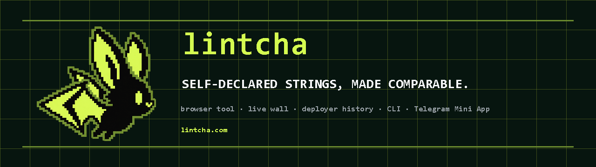

<p align="center"></p>
<p align="center"></p>
<p align="center">


</p>
<!-- the token line, when there is a token: uncomment and paste the contract
<p align="center"><b>$LINTCHA</b> · <code>0x...</code></p>
-->

# lintcha-chain

The repository for lintcha's second site, configured for [chain.lintcha.com](https://chain.lintcha.com/). Its snapshot comparison reads what a
launch on Robinhood Chain calls itself — its name, ticker, description, five link fields, logo and fee recipient — and
reports what those strings are shared with across one day of launches: how many carry the same value, from how many
deployers, and since when. The tree also contains a separate live wall for publishable self-declared names and tickers
after that snapshot boundary, plus bounded retained history for one deployer address. These views read strings.
They do not read a contract, price anything, score anything or predict anything. This README describes what is
implemented and testable in the repository; it does not assert that a deployment has happened.

## What is here

- `site/` is the static output directory. `site/index.html`, `site/404.html`, `site/sitemap.xml` and
  `site/launch-manifest.json` are written by the build; `site/live/` is the owned static live wall and
  `site/deployer/` is the owned retained-history page; `site/launch-index.json` and
  `site/launch-numbers.json` are written by the index writer and refreshed only by a deliberate guarded workflow run; everything else under `site/` is
  either a copy from lintcha or a file this repository owns (see VENDOR.md).
- `src/templates/shell.html` is the comparison around the vendored tool, `src/templates/404.html` the same shell around two
  strings; `src/i18n-src/chain.<lang>.json` are this site's strings, `src/i18n-src/launch.<lang>.json` the vendored
  ones. The build merges them into `src/i18n/<lang>.json`.
- `tools/build.mjs` builds the comparison, sitemap and published integrity manifest; `tools/build-viz.mjs` the three charts and the ornament from the index;
  `tools/build-method.mjs` the method section's tables from the engine's own files; `tools/verify-vendor.mjs` checks
  the vendored files against VENDOR.md; `tools/verify-index.mjs` is `npm run verify`.
- `tools/launch-collect.mjs` and `tools/launch-index.mjs` (vendored) read one day of launches and write the index and
  numbers file. The source-first refresh contract requires one exact finalized identity-state block number/hash, with
  every token, factory and Multicall identity read on its numeric tag and that state carried into the numbers file.
  The owned guard now fails closed when the state is absent, verifies its canonical header before and after repeating
  those identity reads, and re-reads the exact finalized range with
  aligned and shifted page layouts that differ from the collector, compares their canonical raw rows, binds every
  event block hash to a finalized header and refuses publication unless its strict
  event, identity and record reconstruction agrees with the collector. For the transaction sample it reproduces the
  collector's counters, proves exact direct factory/forwarder calls against verified ABIs, and leaves other outer
  wallet/router envelopes classified rather than interpreting them as launch calls.
- `tests/` carries the vendored engine tests and this site's own, including the rendered comparison, live wall,
  deployer history, published-manifest contract and offline identity-kit contracts.
- `lib/identity.mjs`, `tools/identity.mjs` and `fixtures/identity-conformance.json` are the public normalization
  integration kit, its offline JSON CLI and its conformance fixture. The adapter exports the site's engine instead
  of copying its normalization rules.
- `bot/` is the separate API worker: the Telegram webhook, holder verification, the public tail, wall and deployer-history endpoints,
  KV sessions, and two SQLite Durable Objects for the feed and watcher. The watcher object also consumes holder
  nonces atomically. The worker has no runtime dependencies and its own test suite.
- `assets/` is the brand kit: the avatar and the banner above. The site's icons, the social card and the header mark
  (`site/mark-acid.png`) are the same mark.

## Vendored, not edited

lintcha is the source of the engine. Every copied file is a row in VENDOR.md with its sha256 and the lintcha commit it
came from, and is never edited here: a fix goes to lintcha first and is copied back with a new row. Files this
repository writes itself are listed under "owned here" in the same document; a path is added there in the commit that
creates the file. `node tools/verify-vendor.mjs` reports any mismatch, missing, unlisted or duplicate file, and runs in
its own CI workflow on every push (`.github/workflows/vendor.yml`). The separate test workflow runs the complete root
and bot suites, the i18n check, a deterministic build check and the browser contracts.

## Build and test

Node 24, no dependency.

```
npm run build     merge the strings; build the comparison, 404, sitemap and published manifest from the current index and numbers
npm test          verify-vendor plus the config, manifest, token, wall, history, engine, index and identity contracts
npm test --prefix bot     the Telegram, holder, feed, watcher, rules and all five API-route contracts
npm run smoke:production  compare every public static byte, security/MIME header, HTTPS redirect and fail-closed API contract with this tree
npm run i18n      merge the strings and run the vendored i18n check (three languages, en emitted)
npm run verify    refuse the current legacy snapshot before network; for a state-pinned replacement, audit its exact state/window, rebuild, print both hashes
node tests/published_contract_test.mjs     verify the manifest against the exact index and numbers bytes
node tests/chain_browser.mjs site --pages "/,/live/,/deployer/,/hold/,/hold/?t=0123456789abcdef0123456789abcdef"     all rendered-page and holder-flow contracts in a headless browser
npm run identity -- doctor     run the public conformance fixture
node tools/collection-guard.mjs --in <report.json> --published site/launch-numbers.json --diagnose-semantic     reconstruct identities at the report's exact recorded state; this skips event-header batches and sampled transactions and is not publication proof
npm run identity -- help       print the offline JSON CLI contract
npm run identity -- read --input <input.json>     read JSON with the shipped index and its matching manifest
bash tests/console_check.sh site      console-error checks for every published HTML page
bash tests/chain_acceptance.sh     the fourteen criteria, each with the command that ran it
```

## Production checklist

A green local tree is not deployment proof. Before calling a release live, publish both `site/` and the Worker, then
run `npm run smoke:production`; it is credentialless, read-only and exits nonzero on drift in that fixed public
contract. A conforming deployment of both Wrangler configs disables the account `workers.dev` endpoint and per-version
preview URLs, leaving the configured custom origin as the only public copy. In Cloudflare, turn on
[Always Use HTTPS](https://developers.cloudflare.com/ssl/edge-certificates/additional-options/always-use-https/)
and verify the redirect before enabling HSTS. Disable
[Network Error Logging](https://developers.cloudflare.com/network-error-logging/get-started/) and verify that neither `Nel` nor
`Report-To` or `Reporting-Endpoints` sends a browser report to a third party: that would contradict the page's
no-third-party-beacon promise. The smoke also requires every published static response to reproduce the five owned
security headers in `site/_headers`, retain its expected MIME type, and emit no `Set-Cookie`.
Apply a dashboard-level admission/rate rule to `/api/hold`; the Worker bucket is deliberately only a per-isolate work
bound. The Worker-side KV, secrets, routes, Durable Object migrations and the live plan's request budget are separate
manual facts covered by `bot/README.md`; `npm run deploy --prefix bot` must remain blocked until its predeploy check
can prove the local configuration.

Every figure on the snapshot comparison arrives by substitution from `site/launch-numbers.json` or
`site/launch-index.json`; the
build refuses a digit in a template's text or in a string, and its comment names the only other sources (the section
numbers, the engine's tables; the specimen in the diagram carries letters, not figures). The live wall's figures come
from its same-origin API response and are verified before display. The site's origin, used for canonical links, the
social card and the sitemap, is the `origin` key of `site/launch-site.json`.

## Implemented in the tree

- Round E is the public live wall: the owned `/live/` page and the worker's `GET/HEAD /api/wall` route. It keeps the
  snapshot comparison pinned to its recorded window and accepts only a complete, hash-verified post-snapshot suffix.
- Round F is retained deployer history: the owned `/deployer/` page and `GET/HEAD /api/deployer`. It states the exact
  retained watcher range and exposes bounded launch declarations without token addresses or transactions.
- Round G is the holder-alert and bot code under `bot/`. It is locally tested. A null token address keeps the feed
  dormant and does not by itself block deployment; production remains blocked until the room configuration is filled
  and KV, secrets, routes and cron are confirmed against the live account. Webhook activation additionally waits for
  the verified non-null token address promised by the public page.
- Round H is the public normalization integration kit: `lib/identity.mjs`, the `lintcha-chain` JSON CLI and the
  conformance fixture. Its `read` command refuses a custom index without a matching manifest.

The comparison can also copy or download a local fact receipt containing the exact pasted fields, rendered lines and
snapshot context. Creating that JSON makes no request; the receipt is portable context, not independent proof. The
published manifest binds the exact bytes of `site/launch-index.json` and `site/launch-numbers.json`. The watcher and
identity CLI validate those bytes against it; the built page embeds the same index digest and rejects a fetched index
that does not match.

## Where the badge figures come from

The badges above are static images from shields.io, which GitHub renders; nothing under `site/` loads from there.
Each figure is read from the tree, not typed from memory:

```
tests           npm test; npm test --prefix bot              801 root checks + 1432 bot checks = 2233 checks
node            package.json, engines.node                  >=24
runtime deps    package.json                                no "dependencies" key
chain           site/launch-numbers.json, chain_id          4663
index           site/launch-numbers.json, index.entries_total
window          site/launch-numbers.json, window.hours; .github/workflows/launch-refresh.yml, manual-only trigger
licence         LICENSE                                     MIT
```

When a refresh lands a new index, the index badge is a line to edit here; nothing on the page depends on it.

## The refresh workflow

`.github/workflows/launch-refresh.yml` is intentionally manual-only until a strict full refresh passes against the
configured endpoint. Its unattended schedule stays removed. A new collection records one exact finalized block number/hash, and the collector and guard use only that
numeric state tag for identity reads. The legacy published numbers artifact has no such state and `npm run verify`
therefore fails closed until a new guarded refresh replaces it; the verifier never invents a state for old bytes.
When deliberately dispatched, the workflow collects the most recent full day, rebuilds the index, the numbers
file, the integrity manifest and the page, then opens a unique PR containing only those four artifacts after the owned guard re-reads the
exact finalized logs in two alternate page layouts, compares their complete canonical rows, binds each event hash to its block header, derives every UTC
boundary, and rebuilds every table and summary. It also reproduces the collector's sampled-transaction counters;
sampled direct factory/forwarder calls must match their exact verified outer ABI, destination and complete launch
fields, while other outer envelopes remain explicitly uninterpreted. These reads deliberately use the same configured
endpoint and are not described as an independent-provider proof. The job also requires a non-empty internally
consistent window, a published-day sanity floor, the schema, engine and index tests,
verify-vendor before, between and after, and a membership test that allows exactly those four paths to have changed.
It never pushes directly to `main`, and aborts if `main` moved during collection or while its checks ran rather than rebasing generated bytes.
Because a push made by `GITHUB_TOKEN` does not recursively start ordinary push workflows, the refresh opens a draft
PR, explicitly dispatches and waits for both `test.yml` and `vendor.yml` on its unique branch, rechecks `main`, and
marks the PR ready only after both runs pass for the exact generated commit and both the remote branch and PR head
still name that commit. The PR remains the repository-review and merge boundary. GitHub Actions must be allowed to
create pull requests in the repository settings; with that permission disabled, the job stops after pushing its
isolated branch and cannot place generated bytes on `main`.

The strict direct-call check re-reads the factory record at the launch block. Before starting the expensive scan, the
guard proves that both the recorded identity state and the historical launch-window state are available. Set a
credential-bearing archive endpoint in `LINTCHA_CHAIN_RPC_URL`; `--rpc` remains a deliberate override but is visible
in the process argument list, and neither command prints its URL. An endpoint that cannot read either fixed state is a
hard failure. The hosted workflow passes the repository secret of that name only to its collector and guard steps.
When the secret is absent, both commands retain their checked-in public fallback and the same strict fixed-state
checks; an endpoint capability gap therefore remains a hard failure rather than becoming a green publication.

## The token

`site/token.json` ships with every value null and the page carries no token block, no address and no buy link. When an
address and a pons link exist, the block renders from that one file; a uniswap link adds its own button. The three
states are checked by `tests/chain_token_states.mjs` against temporary files, never the tree.

## Licence

MIT, see LICENSE. Not affiliated with Robinhood, pons or any launchpad, and using none of their marks.
